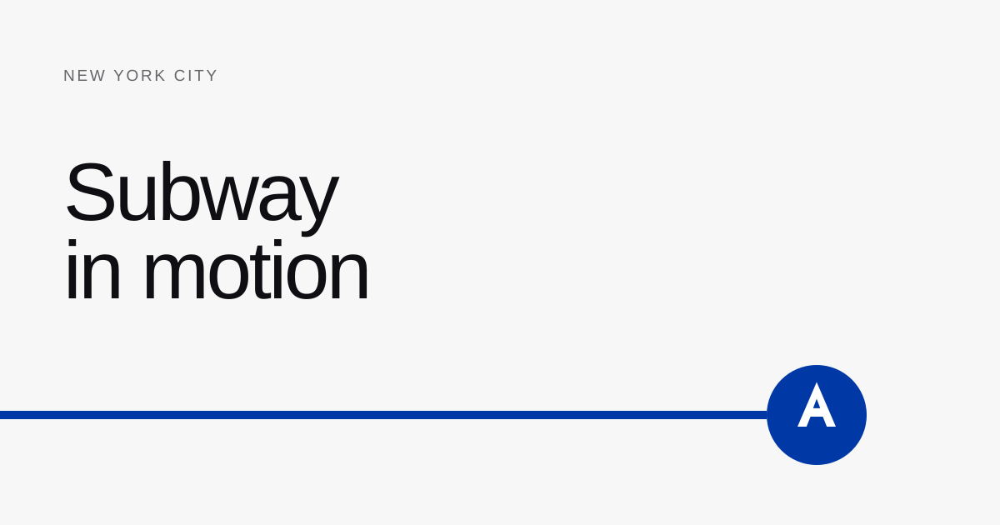

# Subway in Motion



An original, animated map of New York City and its subway network. It shows
where trains would be right now if they followed the MTA's published static
schedule.

This is not a live train tracker or an official MTA map.

## How it works

The app has two parts:

1. A build script turns MTA GTFS and NYC geographic data into small,
   browser-ready files.
2. A Canvas renderer samples the current New York time and draws every
   scheduled train at its estimated position.

```text
MTA GTFS + NYC GeoJSON
          |
          v
  data compiler
          |
          +--> map.<hash>.json
          +--> schedule-<service>.<hash>.json
          +--> manifest.json
                       |
                       v
              two Canvas layers
              map + moving trains
```

The interface uses Next.js 16.3, React 19.2, TypeScript, and the Canvas 2D API.
The static map and animated trains live on separate canvases, so the city only
needs to redraw after a resize, theme change, route filter, or committed camera
move. Train positions are sampled outside React state on each animation frame.

## The position model

GTFS gives us stop times and route shapes, but it does not give each stop's
distance along a shape. The compiler calculates that distance first.

### 1. Project a stop onto its shape

For a stop point $p$ and a shape segment from $a$ to $b$, the nearest point on
the segment is:

$$
u = \operatorname{clamp}\left(
\frac{(p-a) \cdot (b-a)}{\lVert b-a \rVert^2}, 0, 1
\right)
$$

$$
\hat{p} = a + u(b-a)
$$

If $S_j$ is the cumulative shape distance at the start of that segment, the
stop's distance along the shape is:

$$
s_i = S_j + u\lVert b-a \rVert
$$

Stops are processed in trip order. The segment search only moves forward, and
the final distance is clamped so that $s_i \ge s_{i-1}$. This prevents a trip
from jumping backward where a route crosses or runs close to itself.

### 2. Move between scheduled stops

Each trip becomes a list of keyframes $(a_i, d_i, s_i)$ for arrival time,
departure time, and distance along the shape. During a scheduled dwell, the
train stays at $s_i$. Between departure $d_i$ and the next arrival $a_{i+1}$:

$$
q(t) = \operatorname{clamp}\left(
\frac{t-d_i}{a_{i+1}-d_i}, 0, 1
\right)
$$

$$
h(q) = 3q^2 - 2q^3
$$

$$
s(t) = s_i + \left(s_{i+1}-s_i\right)h(q(t))
$$

The smoothstep function $h$ makes departures and arrivals look continuous. It
is a visual estimate, not a physical model of acceleration or live train speed.

### 3. Turn distance back into a map point

The renderer finds the shape vertices whose cumulative distances contain
$s(t)$. For vertices $v_j$ and $v_{j+1}$:

$$
\lambda = \frac{s(t)-S_j}{S_{j+1}-S_j}
$$

$$
r(t) = (1-\lambda)v_j + \lambda v_{j+1}
$$

That point becomes the center of the train roundel. A short direction stem is
traced through the same shape vertices, so it stays attached to curved tracks.

### 4. Separate services into shared lanes

Several subway families use the same corridor. Drawing them on one centerline
hides services according to paint order, so the compiler finds nearby route
families that run in roughly the same direction and assigns each one a centered
lane factor.

For a family with ordered lane index $j$ among $m$ nearby families, the initial
factor is:

$$
f_i = j - \frac{m-1}{2}
$$

The compiler smooths each shape's factors three times with a local weighted
average:

$$
f_i^{(k+1)} = \frac{1}{4}f_{i-1}^{(k)}
+ \frac{1}{2}f_i^{(k)}
+ \frac{1}{4}f_{i+1}^{(k)}
$$

If $\hat{n}_i$ is the stable normal at a shape vertex and $\sigma$ is the
current map-to-screen scale, its rendered point is:

$$
r_i^{\text{lane}} = r_i + f_i\frac{4.7}{\sigma}\hat{n}_i
$$

Dividing by $\sigma$ keeps the lane spacing at a constant screen size at every
zoom level. The colored track, train roundel, and direction stem all sample
this same lane-aware geometry. A train therefore cannot drift away from the
line it belongs to.

## Building the data

The compiler reads these MTA GTFS files:

- `feed_info.txt`, `calendar.txt`, and `calendar_dates.txt`
- `routes.txt`, `trips.txt`, and `stop_times.txt`
- `stops.txt` and `shapes.txt`

It also reads NYC borough, street-centerline, and park GeoJSON. Coordinates are
placed in a local projection centered near New York, rotated by $-29^\circ$ to
give Manhattan its familiar upright orientation, fitted to a $1200 \times 820$
view box, and simplified at a `0.06` tolerance for clean curves at high zoom.

The compiler then:

1. Creates the borough, street, park, landmark, and route geometry.
2. Detects shared corridors and compiles a lane factor for every route vertex.
3. Projects every trip stop onto its route shape.
4. Stores arrival, departure, and shape-distance keyframes for each trip.
5. Groups trips by GTFS service calendar.
6. Writes content-hashed map and schedule chunks.
7. Writes `manifest.json` last, with feed dates and SHA-256 hashes for every
   source file.

The browser selects service with the MTA calendar and exception tables. It
loads both the current service day and the previous one, which preserves GTFS
times such as `25:10:00` after midnight. The display clock always uses
`America/New_York`. If today falls outside the bundled feed window, the app
replays the same time of day on the last covered date and labels it as replay.

To compile a new snapshot:

```bash
MTA_GTFS_DIRECTORY=/path/to/google_transit \
NYC_BOROUGHS_FILE=/path/to/boroughs.geojson \
NYC_MAJOR_STREETS_FILE=/path/to/major-streets.geojson \
NYC_MANHATTAN_STREETS_FILE=/path/to/manhattan-streets.geojson \
NYC_PARKS_FILE=/path/to/parks.geojson \
pnpm data:build
```

See [`data/subway/README.md`](./data/subway/README.md) for the required source
files. Generated assets live in [`public/data/subway`](./public/data/subway).

## Run locally

This project uses pnpm.

```bash
pnpm install
pnpm dev
```

Open [http://localhost:3000](http://localhost:3000).

Run the release checks with:

```bash
pnpm test
pnpm typecheck
pnpm lint
pnpm build
```

## Data and licensing

The committed manifest identifies the exact feed version, coverage dates, and
source hashes used for the current build. Regular static GTFS describes the
planned schedule and omits most temporary service changes.

Schedule data comes from [MTA Developer Resources](https://www.mta.info/developers).
Geography comes from NYC Open Data. The interface and cartography are original.

MTA route indicators, including the blue A-train roundel used in the app icon
and social card, are MTA intellectual property. A public release that keeps
those indicators should follow the
[MTA Licensing Program](https://www.mta.info/doing-business-with-us/licensing-program).
